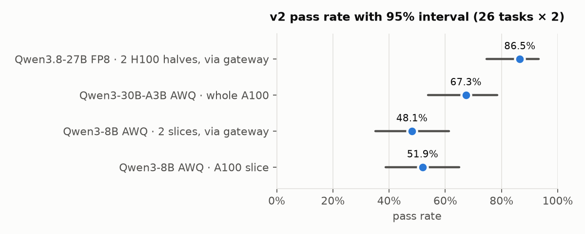
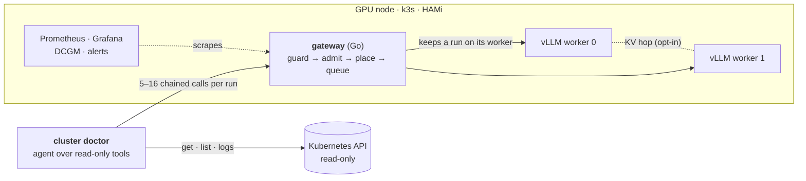
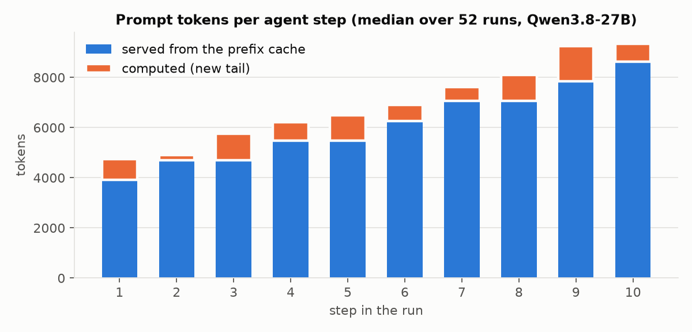
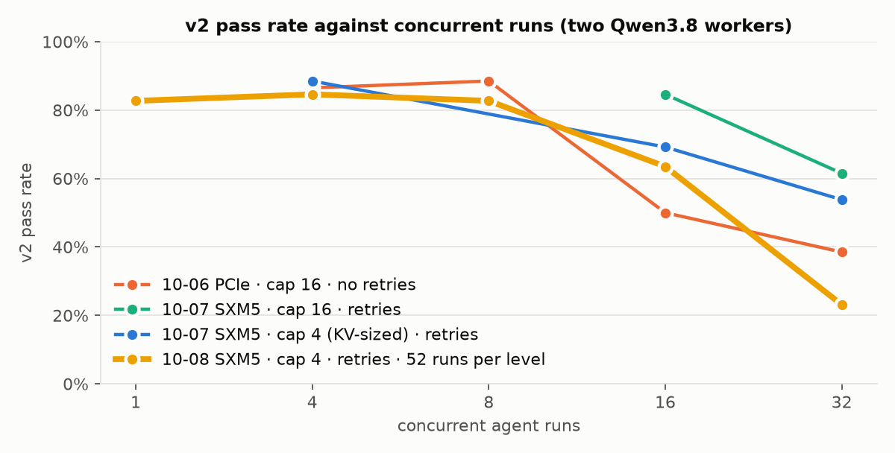

# cluster-doctor

**A read-only root-cause detector for Kubernetes, served on self-hosted GPUs.**

The doctor watches a cluster. When something breaks, an agent follows the chain from the symptom to the object that
actually has to change: a frontend's 502 turns out to be an expired certificate upstream, a crash-looping API an
OOM-killed database. It reports one grounded finding per root cause, cites the evidence it read, and never changes the
cluster. The model runs on vLLM behind a Go gateway on the team's own GPUs, so cluster data stays on them.

Final project for *AI Inference Engineering & Systems Design* (Track B).

## Results at a glance



| | |
|---|---|
| **Best model** | Qwen3.8-27B FP8 on two H100 halves: **86.5%** of 26 recorded faults diagnosed correctly (v2 score), against 52% for Qwen3-8B |
| **Prefix caching** | The prefix cache serves 88% of prompt tokens. Keeping a run on its worker saves **10%** of prefill and makes steps **8–11%** faster |
| **Capacity** | KV memory runs out first. Each H100 half holds about two full-length runs, so the pass rate falls between 8 and 16 concurrent runs |
| **Admission sized to KV** | Cuts vLLM preemptions by **~95%** and lowers tail latency. At the highest loads fewer runs finish, so the cap needs tuning |
| **Restricted data** | **0** requests routed off the box. A fuzz test and an alert guard the rule |

Every number comes from a committed run in `metrics/`. The notebook [`report/report.ipynb`](report/report.ipynb)
rebuilds them (`make report`) and [`design/findings.md`](design/findings.md) gives the evidence for each.

## How it works



1. A scan that calls no model finds changed symptoms. The **agent** then investigates with read-only tools. It may cite
   only evidence it was shown, or it answers `inconclusive`.
2. The **gateway** refuses bad requests (400), enforces tenant quotas (429), sheds load when KV is short (503), keeps
   each run on the worker that holds its cached history, and queues by priority.
3. **vLLM** serves the model on GPU slices. Prometheus scrapes the gateway and both workers, Grafana charts them, and
   five tested alert rules fire on overload or a broken invariant.

The full design is in [`design/architecture.md`](design/architecture.md) and [`design/gateway.md`](design/gateway.md).

### Why the cache matters

Each agent step resends the whole conversation, but only its newest tool result is new. By step 10 the median prompt
is 9,337 tokens, and the prefix cache leaves only 713 of them to compute.



### Where it breaks

With two workers the pass rate holds to 8 concurrent runs and falls past that, as KV runs out. Sizing admission to the
measured KV pool stops vLLM from preempting, but at these loads it finished fewer runs than the old fixed cap.



## Quick start

**Offline, no GPU:**
```
make tools && uv sync      # pinned kind, kubectl, promtool, golangci-lint, gitleaks; the locked Python stack
make hooks                 # secret scan and Go checks before each commit and push
make lint test             # Python, Go and alert-rule tests over recorded faults
make demo                  # the gateway in front of two fake workers, golden set at concurrency 8
make report                # rebuild the results notebook and charts from metrics/
```

**Ask the doctor** (model at `DOCTOR_BASE_URL`, default `http://127.0.0.1:8000/v1`):
```
uv run python -m doctor investigate -n inventory "stock-api keeps restarting"
uv run python -m doctor watch --context <ctx>       # autonomous: scan every 60 s, /metrics on :9109
```
Exit codes: 0 healthy, 1 issue, 2 no grounded diagnosis.

**On a Lambda GPU** (billed from `make up` to `make down`; `make help` prints this):
```
make preflight && make up  # first of H100, GH200, A100 with capacity
make bringup               # workers on HAMi slices, KV measured, gateway, dashboards
make tunnel                # terminal 2: the gateway at localhost:8000
make grafana               # terminal 3: dashboards at localhost:3000
make bench TAG=run1        # golden set + concurrency sweep + metrics
git add metrics && git commit && make down
```
The full session plan is in [`design/lambda-test-plan.md`](design/lambda-test-plan.md).

## Repository

| Path | What |
|---|---|
| `doctor/` | the agent, read-only tools, scan and watch loop, validation, redaction, CLI |
| `gateway/` | the Go gateway: admission, placement, queue, metrics, KV hop |
| `evals/` | the golden set (26 faults), scorer and load runner |
| `serving/` | model profiles, fit calculator, model matrix |
| `deploy/` | GPU bootstrap, manifests, dashboards, alert rules |
| `report/` | the results notebook and its data loaders |
| `design/` | decisions, findings, architecture, figures, test plan |
| `faults/`, `fixtures/`, `lab/` | injected faults, recorded snapshots, the kind lab and GPU launcher |

## Safety

- **Read-only.** The doctor's only kubectl verbs are `get`, `logs`, `top` and `version`; its RBAC has no Secrets and no
  writes.
- **Grounded.** A diagnosis that cites evidence the model was never shown is rejected; after two repairs the answer is
  `inconclusive`, never a guess.
- **Private.** Secrets are redacted before storage, log lines that try to instruct the model are flagged, and
  restricted data never leaves self-hosted inference.

## Documents

| Read | For |
|---|---|
| [`SPEC.md`](SPEC.md) | the source of truth: components, invariants, pins |
| [`design/findings.md`](design/findings.md) | what the measurements showed, with evidence |
| [`design/decisions.md`](design/decisions.md) | why each choice was made |
| [`report/report.ipynb`](report/report.ipynb) | the results notebook, answering the brief's questions |
| [`design/course-objectives.md`](design/course-objectives.md) | each part of the brief mapped to its evidence |
| [`design/slides.md`](design/slides.md) | the presentation (Marp Markdown) |
