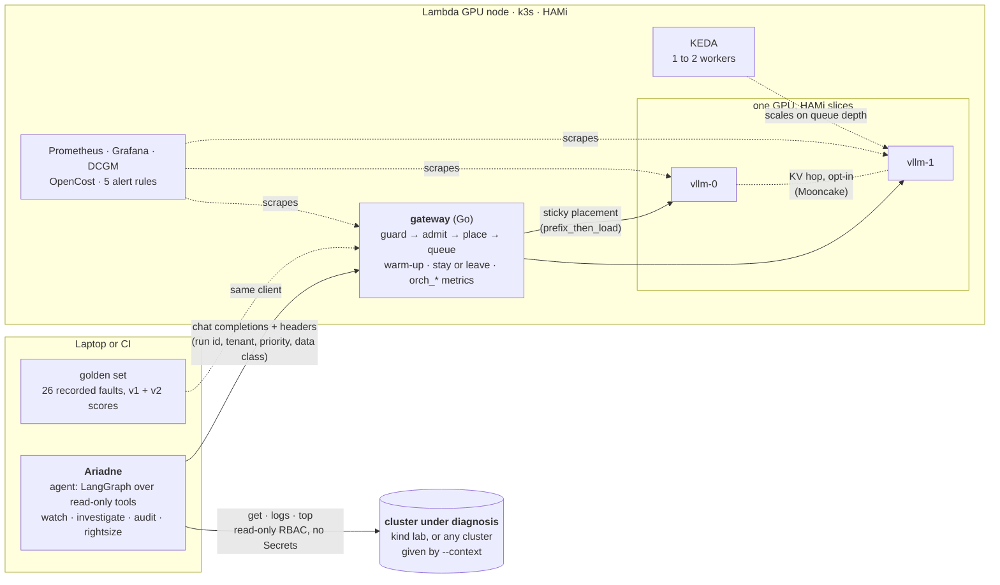

# Ariadne

**A self-hosted inference stack, measured under the load of a Kubernetes root-cause agent.**

[](https://github.com/cduggn/cluster-doctor/actions/workflows/ci.yml)

> In Greek myth, Ariadne gave Theseus a ball of thread so he could find his way through the Minotaur's labyrinth and
> back out. Kubernetes is the modern labyrinth. Ariadne is the thread that leads an engineer straight to the beast:
> the root cause.

Ariadne is the final project for *AI Inference Engineering & Systems Design* (Track B). The app is an agent that
investigates a broken cluster with read-only tools and names the object that has to change. The subject is the stack
that serves it: vLLM on HAMi slices of one GPU, behind a Go gateway that guards, admits, places and queues every call,
with Prometheus, Grafana and tested alerts watching each hop. Every number below comes from a committed run in
`metrics/`.

## What the stack is



Qwen3.8-27B FP8 runs on two 39 GiB halves of one H100. The agent makes 5 to 16 chained calls per run, and each call
resends the whole conversation, so the workload is a long shared prefix with a short new tail. Two rules follow from
that: keep a run on the worker that holds its history, and protect KV before anything else.

## What we measured

| Question from the brief | Answer | Evidence |
|---|---|---|
| What limits concurrency first? | KV. An H100 half holds 51,092 tokens, about two full-length runs. The fit calculator said 77,926, 34% optimistic for the hybrid model. | F5, F6 |
| How much does the prefix cache carry? | 88% of prompt tokens. By step 10 a 9,337-token prompt leaves 713 tokens to compute. | F8, F9 |
| Does placement matter? | Keeping a run on its worker cut prefill by 10% and step time by 8–11%, with the same answers. | F29 |
| Where does it break? | Between 8 and 16 concurrent runs. 88.5% of runs pass at 8 and 50% at 16. | F24 |
| Shed at the door, or preempt in the engine? | Sizing admission to the measured KV pool cut vLLM preemptions by ~95% and tail latency by ~15%, but finished fewer runs at 16 and 32. The cap needs tuning to 6–8. | F36 |
| Does restricted data stay on the box? | Yes. `orch_restricted_offbox_total` is 0 in all 13 gateway scrapes, backed by a fuzz test and a critical alert. | D-42, D-45 |
| Does the KV hop work? | 8 hops completed the Mooncake protocol with 0 failures. Whether the KV moved instead of being recomputed is unconfirmed. | F35 |


The notebook [`report/report.ipynb`](report/report.ipynb) rebuilds every chart from `metrics/` with `make report`.
Its section 10 answers the brief's Part 5, "what runs next", from time series exported during the run.
[`design/findings.md`](design/findings.md) gives each finding with the file it comes from.

## How a request moves through the gateway

The gateway (`gateway/`, D-42) makes four decisions in order, and names every refusal on `orch_shed_total{reason}`.

1. **Guard.** A malformed body, streaming, or a client-supplied `kv_transfer_params` gets a 400.
2. **Admit.** A tenant over its token quota gets a 429 (`tenant_tokens`). A request gets a 503 when its worker is
   below 20% free KV (`kv_free`) or when it would miss its queue deadline (`timeout_queue`). Only a 503 may leave the
   box, and a restricted request never does.
3. **Place.** `prefix_then_load` keeps a run on the worker that holds its history unless that worker is much busier.
   `least_loaded` and `p2c` are the A/B controls.
4. **Queue.** Each worker has an interactive lane and a batch lane with deadlines, and at most `GW_MAX_INFLIGHT`
   requests in flight. `make gateway` sizes that cap from the worker's measured KV pool (D-43).

A worker takes traffic only after two warm-up probes replay the agent's real first request, which also loads the
shared prefix into its cache. The full design is in [`design/gateway.md`](design/gateway.md).

## How it is observed

| Dashboard | Shows |
|---|---|
| `Ariadne · cluster` | the node, pods and restarts; every request by outcome; KEDA's desired against ready workers |
| `Ariadne · gateway` | sheds by reason, placement and stickiness, queue depth per pod, latency by hop, KV hops |
| `Ariadne · vLLM engine + GPU` | KV use, waiting against running, preemptions, TTFT and ITL, batch size, DCGM power and memory |

Five alert rules in `deploy/observability/alerts.yaml` take their thresholds from the gateway's own limits. promtool
tests check that each rule fires on its condition and stays quiet below it (D-45).
[`design/walkthrough.md`](design/walkthrough.md) is the presentation's tour of the code and the dashboards.

## Run it

Offline, with no GPU:

```
make tools && uv sync      # pinned kind, kubectl, promtool, golangci-lint, gitleaks; the locked Python stack
make hooks                 # secret scan and Go checks before each commit and push
make lint test             # Python, Go and alert-rule tests over recorded faults
make demo                  # the gateway in front of two fake workers, golden set at concurrency 8
make report                # rebuild the results notebook and charts from metrics/
```

On a Lambda GPU, billed from `make up` to `make down` (`make help` prints the session in order):

```
make preflight && make up  # first of H100, GH200, A100 with capacity
make bringup               # workers on HAMi slices, KV measured, gateway, dashboards
make tunnel                # terminal 2: the gateway at localhost:8000
make grafana               # terminal 3: dashboards at localhost:3000
make bench TAG=run1        # golden set, concurrency sweep, queue probes, then the time-series export
git add metrics && git commit && make down
```

[`design/lambda-test-plan.md`](design/lambda-test-plan.md) has the full session plan.

## The workload: an agent that finds the root cause

Ariadne follows the chain from a symptom to the object that has to change. A frontend's 502 turns out to be an
expired certificate upstream, and a crash-looping API turns out to be an OOM-killed database. It reports one grounded
finding per root cause and never changes the cluster.

```
uv run python -m doctor investigate -n inventory "stock-api keeps restarting"
uv run python -m doctor watch --context <ctx>       # autonomous: scan every 60 s, /metrics on :9109
```

The agent reads the model at `DOCTOR_BASE_URL` (default `http://127.0.0.1:8000/v1`). It exits 0 for healthy, 1 for
an issue and 2 for no grounded diagnosis.

- **Read-only.** The agent's only kubectl verbs are `get`, `logs`, `top` and `version`. Its RBAC has no Secrets and
  no writes.
- **Grounded.** A diagnosis that cites evidence the model was never shown is rejected. After two repairs the answer
  is `inconclusive`, never a guess.
- **Private.** Secrets are redacted before storage, and restricted data never leaves self-hosted inference.

The model was chosen on 26 recorded faults in four tiers. Qwen3.8-27B diagnoses 86.5% of them correctly, against 52%
for Qwen3-8B, and scores 100% on the red herrings that fool rule-based tools (F1).
[`design/model-matrix.md`](design/model-matrix.md) compares every candidate on paper and in runs.

## Repository

| Path | What |
|---|---|
| `gateway/` | the Go gateway: admission, placement, queue, metrics, KV hop |
| `deploy/` | GPU bootstrap, manifests, KEDA, dashboards, alert rules |
| `serving/` | model profiles, the fit calculator, the model matrix |
| `doctor/` | the agent: read-only tools, scan and watch loop, validation, redaction, CLI |
| `evals/` | the golden set (26 faults), the scorer and the load runner |
| `lab/` | the kind lab, the GPU launcher, queue probes and the time-series export |
| `report/` | the results notebook and its data loaders |
| `design/` | decisions, findings, architecture, figures, test plan, slides |
| `faults/`, `fixtures/` | injected faults and recorded cluster snapshots |

## Documents

| Read | For |
|---|---|
| [`design/course-objectives.md`](design/course-objectives.md) | each part of the brief mapped to its evidence |
| [`design/findings.md`](design/findings.md) | what the measurements showed, with the file behind each number |
| [`design/decisions.md`](design/decisions.md) | why each choice was made |
| [`SPEC.md`](SPEC.md) | the source of truth: components, invariants, pins |
| [`design/slides.md`](design/slides.md) | the presentation (Marp Markdown) |
