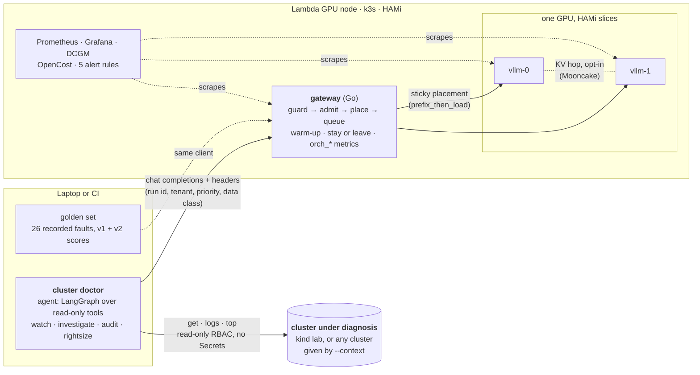

# Architecture

The cluster under diagnosis is separate from the serving stack. The doctor reads whatever cluster its kubeconfig
context names: the kind lab for the recorded faults, or the GPU node's own k3s for the live-only ones. It never
writes to it.

**One request's path.** The doctor makes 5–16 chained calls per run, each carrying `X-Request-Id`
(task-run-step), `X-Tenant`, `X-Priority` (interactive or batch) and `X-Data-Class: restricted`. The gateway
(`gateway/`, D-42) takes four steps in order.
1. **Guard.** Malformed bodies, streaming and client-supplied `kv_transfer_params` get a 400.
2. **Admit.** A tenant over its token quota gets a 429. A request gets a 503 when its worker is below 20% free KV or
   when it would miss its queue deadline.
3. **Place.** A run stays on the worker that holds its history unless that worker is much busier (`prefix_then_load`).
4. **Queue.** Each worker has a priority queue and at most `GW_MAX_INFLIGHT` requests in flight, a cap sized to the
   worker's measured KV pool (D-43).

A 503 may overflow off the box for non-restricted data only, and the overflow backend is null today.

**Two traffic classes, one GPU.** Investigations are interactive (a person is waiting, p95 matters); audits are batch
(several namespaces, long contexts, can wait or be shed first). Both carry the restricted data class, so cluster data
never leaves self-hosted inference. That is the product's premise and the gateway's overflow rule.

**Hardware.** `make up` takes the first of H100 PCIe, H100 SXM5, GH200 and A100 with capacity. One cloud-init detects
the card:

| GPU | Workers | Model |
|---|---|---|
| A100 40 GB | two 20 GiB slices | Qwen3-8B-AWQ |
| H100 80 GB | two 39 GiB halves | Qwen3.8-27B-FP8 (KV hop on) |
| GH200 96 GB | whole card | Qwen3.8-27B-FP8 |

The course names four scarce resources, and each has a place here: decode slots, KV blocks, hop bandwidth and
warm-up. See
`design/findings.md` for the measurements, `report/report.ipynb` for the charts, and `design/course-objectives.md` for
how each brief question is answered.
