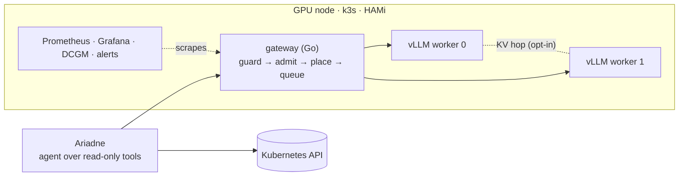
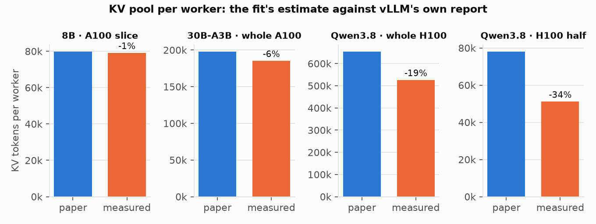
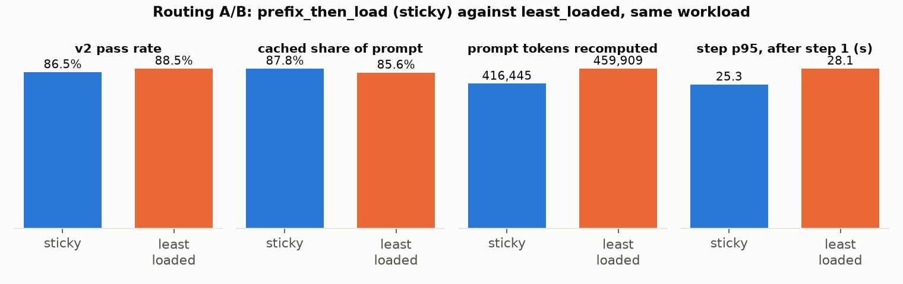
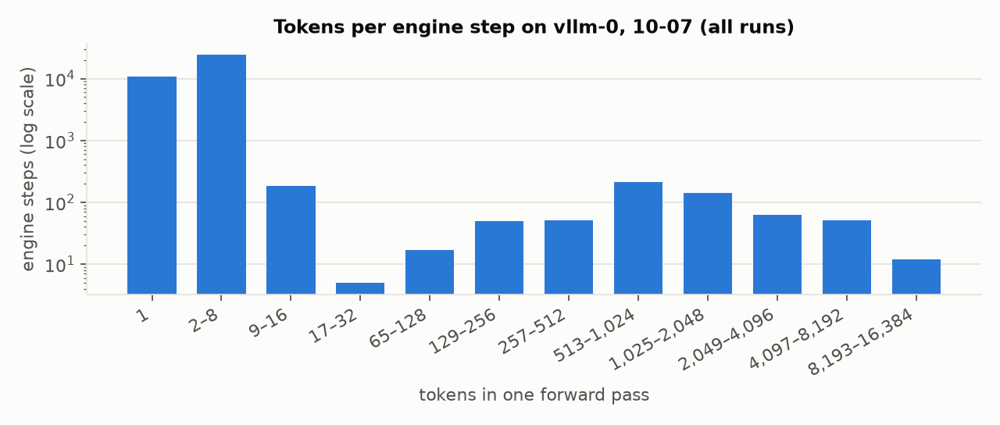

# Ariadne

A read-only root-cause detector for Kubernetes, served on self-hosted GPUs

AI Inference Engineering & Systems Design · final project, Track B · 2026-10-07

---

## The app

- An agent investigates a Kubernetes fault with read-only tools and names the object that has to change.
- A frontend's 502 traces back to an expired upstream certificate, and a crash-looping API to an OOM-killed database.
- It cites only evidence it was shown. If it can't, it answers `inconclusive`.
- Cluster data is restricted, so it never leaves the team's own GPUs.

Each run makes 5 to 16 chained model calls. Investigations are interactive; audits and right-sizing are batch.

---

## Architecture

Two Qwen3.8-27B FP8 workers on HAMi halves of one H100, behind the gateway (D-42).

---

## Shared and unique tokens

Every call starts with the same 3.8k-token prefix. Each step adds a few hundred new tokens. By step 10 the median prompt
is 9,337 tokens, and vLLM computes only 713 of them (F8–F10).

---

## Which model

Qwen3.8-27B diagnoses 86.5% of 26 recorded faults, against 52% for the 8B. It scores 100% on red herrings, the tier
where rules point at the wrong object (F1).

---

## Capacity: KV runs out first

An H100 half holds 51k tokens of KV, about two full-length runs. The fit calculator was 34% optimistic for the hybrid
model (F5, F6).

---

## Placement: keep a run on its worker

Without stickiness, vLLM recomputed 10% more prompt tokens and steps were 8–11% slower, with the same answers (F29).

---

## Under load: the knee

The pass rate holds to 8 concurrent runs and falls past 16 (F24). Sizing admission to KV cut preemptions by ~95% but
finished fewer runs, because queued requests hit their deadline (F36).

---

## What dies where

| Step | Code | Reasons seen |
|---|---|---|
| Guard | 400 | malformed body, streaming, client `kv_transfer_params` |
| Admit | 429 / 503 | tenant quota; `kv_free` up to the knee, then `timeout_queue` once admission was sized (F32) |
| Place | none | never refuses; a run moves if its worker is much busier or has restarted |
| Queue | 503 | deadline (interactive 10 s, batch 30 s) |

Only a 503 may leave the box, and a restricted request never does. 0 left (fuzz test and alert).

---

## Inside the engine

Most steps decode one to a few requests. Steps near the 8,192-token chunk limit are rare, because the prefix cache keeps
each step's uncached tail small (F14, F15).

---

## Production alerts

| Alert | Fires when |
|---|---|
| `KVCacheSaturated` | KV above the gateway's 0.80 shed line for 5 min |
| `GatewayQueueWaitHigh` | queue p95 above 5 s, half the interactive deadline |
| `VLLMPreempting` | any preemption for 5 min |
| `DoctorInconclusiveRateHigh` | over 20% inconclusive in an hour |
| `RestrictedRequestOffBox` | any restricted request leaves (critical) |

promtool tests check that each rule fires on its condition and stays quiet just below it (D-45).

---

## Scaling: which pool, on what signal

- The vLLM worker pool is the only pool, and KV per worker is the limit (F6, F24).
- KEDA scales `statefulset/vllm` from 1 to 2 workers, the two halves of one H100 (D-49).
- Workers wanted = ⌈(in flight + queued) ÷ the per-worker cap of 4⌉, the same cap admission uses (D-43).
- A second trigger adds a worker on any capacity shed. A tenant over quota doesn't count.
- It scales up after a minute and down after 10 quiet minutes, never to zero, because a new worker takes minutes to load.

Both signals are recording rules with promtool tests. Rehearsed on kind (F38); measured on the H100 in session 5.

---

## The dashboards, in walkthrough order

| Topic | Dashboard and panel |
|---|---|
| Cluster | `Ariadne · cluster`: node, pods, restarts, CPU, GPU memory per slice |
| Success and failures | `Ariadne · cluster`: request outcomes, share answered, upstream errors |
| Admission | `Ariadne · gateway`: admitted vs shed by reason |
| Router | `Ariadne · gateway`: placement per pod, stickiness, prompt tokens by kind |
| Queue depth | `Ariadne · gateway`: in flight and queued per pod, queue wait |
| vLLM | `Ariadne · vLLM engine + GPU`: KV, preemptions, prefix hits, TTFT, batching |
| Mooncake KV | `Ariadne · gateway`: KV hops by result, hop latency |
| Replicas and KEDA | `Ariadne · cluster`: wanted vs ready workers, demand per worker, sheds, phase |

The code behind each one is in `design/walkthrough.md`.

---

## At 10× traffic

- Add workers, not bigger slices. KV per worker is the limit.
- Retune the cap to 6–8 per H100 half, or lengthen the interactive queue deadline.
- A second gateway replica needs a shared run table or runs partitioned by id.
- An overflow backend for non-restricted work turns refusals into slower answers. Superlinked is blocked on billing (F22).
- The KV hop pays off once contexts grow. It completed 8 hops on hardware; the transfer itself is unconfirmed (F35).
- Settings that don't fit this workload: the 768-token output cap never bound (F30).

---

## Evidence

- `report/report.ipynb` rebuilds every chart from `metrics/` (`make report`).
- `design/findings.md` gives F1–F37 with the file behind each number.
- `design/decisions.md` records why each choice was made (D-1 to D-46).
- `make lint test` covers Python, Go and the alert rules; CI runs the same.
